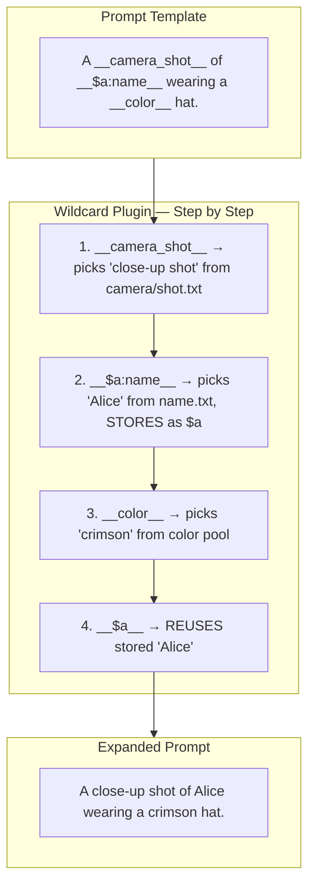

## Legend

| Syntax | What it does |
|---|---|
| `__file__` | Random pick from `wildcards/file.txt` |
| `__$var=value__` | Assign literal `value` to `var` (no random pick) |
| `__$var:file__` | Random pick + **store** under name `var` |
| `__$var__` | **Reuse** stored `var` value |
| `{a\|b\|c}` | Random inline choice |
